A working agent is more than a model call. It needs a front door, authentication,
somewhere to run, a model provider, a place to keep state and documents, and a way
to see what it is doing. Here is a simple, production-shaped layout for an agentic
AI service on AWS. It is close to what I run day to day.

## The architecture

```mermaid
architecture-beta
    group aws(logos:aws)[AWS Cloud]
    group vpc(logos:aws-vpc)[VPC] in aws

    service users(internet)[Users]
    service apigw(logos:aws-api-gateway)[API Gateway] in aws
    service cognito(logos:aws-cognito)[Cognito] in aws
    service eks(logos:aws-eks)[Agent Service] in vpc
    service bedrock(logos:aws)[Bedrock LLM] in aws
    service rds(logos:aws-rds)[PostgreSQL] in vpc
    service search(logos:aws-open-search)[Vector Store] in vpc
    service cw(logos:aws-cloudwatch)[CloudWatch] in aws

    users:R --> L:apigw
    cognito:B --> T:apigw
    apigw:R --> L:eks
    eks:R --> L:bedrock
    eks:B --> T:rds
    eks:T --> B:search
    bedrock:B --> T:cw
```

## What each piece does

- **API Gateway** is the single entry point. It handles routing, rate limits, and
  request validation before anything reaches the service.
- **Cognito** handles auth. Users get a token, the gateway checks it, and the agent
  service never touches raw credentials.
- **Agent Service on EKS** is the FastAPI app and the agent loop, running on
  Kubernetes. It orchestrates tools over MCP and talks to the model.
- **Bedrock** is the managed model provider. Keeping the model behind Bedrock means
  no GPUs to run and a clean IAM boundary.
- **PostgreSQL on RDS** holds sessions, state, and application data.
- **Vector Store (OpenSearch)** handles retrieval and semantic tool search.
- **CloudWatch** collects metrics, logs, and traces, so a change in behaviour shows
  up as a number rather than a surprise.

## Why this shape

- Keep the model provider separate from the app. You can switch models without
  touching the service.
- Put everything stateful inside the VPC. The database and the vector store are not
  exposed to the internet.
- Make the entry point do the boring work. Auth, rate limits, and validation belong
  at the gateway, not scattered through the code.
- Trace from day one. Observability is much cheaper to add now than after the first
  incident.

This is a starting point, not the whole story. Add a queue for slow jobs, a cache
in front of the model, and separate environments, and you have something you can
grow.
