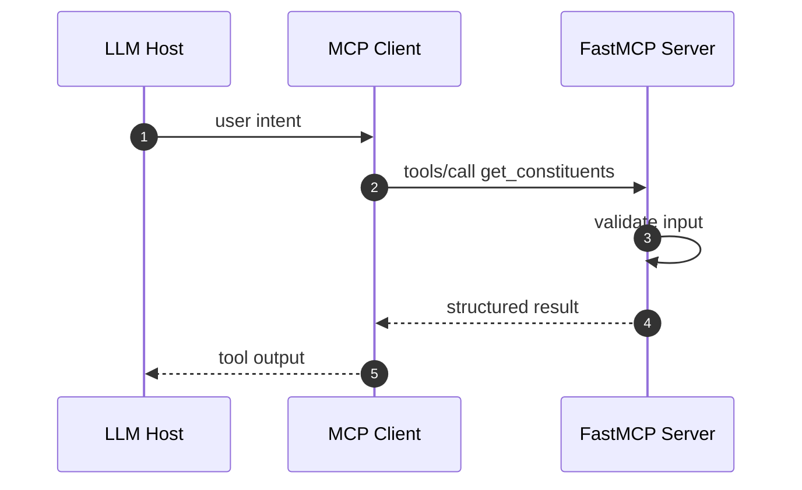

The **Model Context Protocol (MCP)** is an open standard for connecting LLM
applications to tools, data, and prompts through one interface. Instead of
hardcoding every integration into your agent, you put capabilities behind a
protocol that the model can discover and call at runtime. This post covers how
MCP is put together, the math behind context cost, and the practices that keep an
MCP server reliable in production.

## Host, Client, and Server

MCP splits the world into three roles:

- **Host**: the LLM application. It runs the agent loop and decides what it wants.
- **Client**: manages a single connection to one server, and speaks the protocol.
- **Server**: exposes capabilities. These come in three kinds. **Tools** are
  functions the model can call. **Prompts** are reusable templates. **Resources**
  are read-only data the host can pull into context.

The point is to keep responsibilities apart. The host asks for things. The server
owns how they are fetched or run. The model never sees credentials, internal IDs,
or transport details.

## The tool call, step by step

Clients and servers talk over JSON-RPC 2.0, on stdio for local processes or
HTTP/SSE for remote ones. Here is a single tool call as a sequence:



Discovery happens at runtime. The client calls `tools/list` to see what a server
offers, then `tools/call` to run one. You can change what a server does without
redeploying the host.

## The cost of context

Tool results are not free. They are tokens, and tokens are money and latency. For
a tool that returns N rows, the added context grows on the order of $O(N)$ tokens.
Over a conversation with k tool calls, the total overhead is the sum of each
result's size:

$$ \text{overhead} = \sum_{i=1}^{k} t_i $$

where $t_i$ is the token count of the i-th tool result. Keeping every $t_i$ small,
by projecting and paginating, is what keeps the whole conversation affordable.

## Building a server with FastMCP

[FastMCP](https://github.com/jlowin/fastmcp) is a simple way to write MCP servers
in Python. You decorate plain functions, and it handles the protocol.

First, create the server:

```python
from fastmcp import FastMCP
import httpx

mcp = FastMCP("index-tools")
```

Then the tool. The part that matters most in production is error handling. A tool
should never send a stack trace back to the model, because the model will repeat
it to the user word for word. So every path returns a plain dict with typed input:

```python
@mcp.tool()
async def get_constituents(index_id: str) -> dict:
    """Return the current constituents of a published index.

    Args:
        index_id: The public index identifier, e.g. "BITA-EU-TECH".
    """
    if not index_id or len(index_id) > 64:
        return {"error": "invalid_input", "detail": "index_id is required (<=64 chars)"}

    try:
        async with httpx.AsyncClient(timeout=10.0) as client:
            resp = await client.get(
                f"https://api.internal/indices/{index_id}/constituents"
            )
            resp.raise_for_status()
            return {"index_id": index_id, "constituents": resp.json()}
    except httpx.TimeoutException:
        return {"error": "timeout", "detail": "index service did not respond in time"}
    except httpx.HTTPStatusError as exc:
        return {"error": "upstream_error", "status": exc.response.status_code}
    except Exception:
        return {"error": "internal_error", "detail": "could not retrieve constituents"}
```

Finally, run it:

```python
if __name__ == "__main__":
    mcp.run()
```

## Production best practices

- **Context**: return only what is useful. Select and paginate, do not dump. Prefer
  a reference ID over a large blob the model has to carry around.
- **Safety**: validate every input. Treat model arguments as untrusted. Keep
  destructive actions behind an allowlist, and make tools idempotent where you can.
- **Observability**: trace every tool call with Langfuse or OpenTelemetry, score
  tool choice with an LLM-as-a-Judge step, and track cost per conversation so a
  regression shows up as a number.

> The protocol gives you a clean line between the model and your systems. Most of
> the reliability work happens on that line, not inside the model.

That is the whole idea. Get the boundary right, and the rest of the agent gets
much simpler. If you have questions or run MCP differently, leave a comment below.
