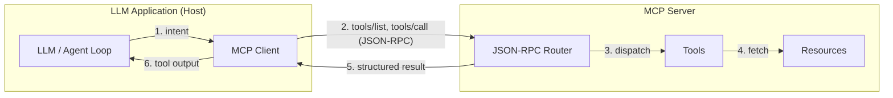

The **Model Context Protocol (MCP)** is an open standard for connecting LLM
applications to tools, data, and prompts through a uniform interface. Instead of
hardcoding every integration into your agent, you expose capabilities behind a
protocol the model can discover and call at runtime. This post covers how MCP is
structured and the practices that keep it reliable in production.

## The architecture

MCP separates the world into a **Host**, one or more **Clients**, and one or more
**Servers**. The host is the LLM application; each client manages a single
connection to a server; each server exposes capabilities. Those capabilities come
in three kinds:

- **Tools** — functions the model can invoke (e.g. "get index constituents").
- **Prompts** — reusable, parameterised prompt templates.
- **Resources** — read-only data the host can pull into context (files, records,
  documents).

The key idea is **separation of concerns**: the host decides *what* it wants; the
server owns *how* it is fetched or executed. The model never sees credentials,
internal IDs, or transport details.

### Communication flow

Clients and servers speak **JSON-RPC 2.0** over a transport (stdio for local
processes, or HTTP/SSE for remote servers). A typical exchange looks like this:



At startup the client calls `tools/list` to discover what the server offers, then
`tools/call` to invoke a specific tool. Because discovery happens at runtime, you
can add or change server capabilities without redeploying the host.

## Building a server with FastMCP

[FastMCP](https://github.com/jlowin/fastmcp) is the ergonomic Python way to write
MCP servers — you decorate plain functions and it handles the protocol. The part
that matters in production is **error handling**: a tool must never leak a stack
trace or an unhandled exception back into the model's context, because the model
will faithfully repeat it to the user.

```python
from fastmcp import FastMCP
import httpx

mcp = FastMCP("index-tools")

@mcp.tool()
async def get_constituents(index_id: str) -> dict:
    """Return the current constituents of a published index.

    Args:
        index_id: The public index identifier, e.g. "BITA-EU-TECH".
    """
    if not index_id or len(index_id) > 64:
        return {"error": "invalid_input", "detail": "index_id is required (<=64 chars)"}

    try:
        async with httpx.AsyncClient(timeout=10.0) as client:
            resp = await client.get(
                f"https://api.internal/indices/{index_id}/constituents"
            )
            resp.raise_for_status()
            return {"index_id": index_id, "constituents": resp.json()}

    except httpx.TimeoutException:
        return {"error": "timeout", "detail": "index service did not respond in time"}
    except httpx.HTTPStatusError as exc:
        # Map upstream status to a clean, model-safe message
        return {"error": "upstream_error", "status": exc.response.status_code}
    except Exception:
        # Never surface internals; log the real cause server-side
        return {"error": "internal_error", "detail": "could not retrieve constituents"}


if __name__ == "__main__":
    mcp.run()
```

Notice the tool always returns a **structured dict**, success or failure. The
model can branch on `error` and respond gracefully instead of hallucinating.

## Production best practices

### Context window management

- **Return the minimum useful payload.** Tools should project and paginate, not
  dump. A 4,000-row response will blow the context window and the budget.
- **Summarise resources before injection.** For large documents, expose a
  summarised resource and let the host request detail on demand.
- **Prefer references over blobs.** Return an ID the model can pass to a follow-up
  tool rather than inlining a megabyte of JSON.

### Tool safety

- **Validate every input** at the tool boundary; treat model-supplied arguments
  as untrusted user input.
- **Apply-then-disclose for mutations.** Use documented defaults, make the effect
  explicit in the result, and keep destructive actions behind an allowlist.
- **Make tools idempotent** where possible, so a retried call does no harm.
- **Fail closed.** On ambiguity, return an error the model can act on rather than
  guessing.

### Observability

- **Trace every tool call** with something like Langfuse or OpenTelemetry —
  arguments, latency, and the real wire payload, not the model's paraphrase.
- **Score tool selection** with an LLM-as-a-Judge pass so you can measure whether
  the agent is calling the *right* tool, not just a tool.
- **Track cost per conversation** by model, so a regression in tool-calling
  behaviour shows up as a number, not a surprise invoice.

> The protocol gives you a clean seam between the model and your systems. Most of
> the reliability work happens *at that seam* — validation, structured errors, and
> tracing — not inside the model.

MCP won't make a fragile system robust on its own, but it gives you the right
place to put the robustness. Get the boundary right and the rest of the agent
gets a lot simpler.
