The **Model Context Protocol (MCP)** is an open standard for connecting LLM
applications to tools, data, and prompts through one interface. Instead of
hardcoding every integration into your agent, you put capabilities behind a
protocol that the model can discover and call at runtime. This post explains how
MCP is put together, and the practices that keep it reliable in production.

## The architecture

MCP splits the world into a **Host**, one or more **Clients**, and one or more
**Servers**. The host is the LLM application. Each client manages a single
connection to a server. Each server exposes capabilities, and those come in three
kinds:

- **Tools**: functions the model can call, for example "get index constituents".
- **Prompts**: reusable prompt templates with parameters.
- **Resources**: read-only data the host can pull into context, such as files or
  records.

The point is to keep responsibilities apart. The host decides what it wants. The
server owns how it is fetched or run. The model never sees credentials, internal
IDs, or transport details.

### Communication flow

Clients and servers talk over **JSON-RPC 2.0**. The transport is stdio for local
processes, or HTTP/SSE for remote servers. Here is the flow of a single tool call,
from the model's intent down to the data source and back:

```mermaid
flowchart LR
    subgraph Host["LLM Application (Host)"]
        direction TB
        LLM["LLM / Agent Loop"]
        Client["MCP Client"]
    end
    subgraph Server["MCP Server"]
        direction TB
        Router["JSON-RPC Router"]
        Tools["Tools"]
        Res["Resources"]
    end
    DB[("Data source")]

    LLM -->|"1 intent"| Client
    Client -->|"2 tools/call"| Router
    Router -->|"3 dispatch"| Tools
    Tools -->|"4 read"| Res
    Res -->|"5 query"| DB
    Router -->|"6 result"| Client
    Client -->|"7 output"| LLM

    classDef blue   fill:#2563EB,stroke:#1E3A8A,stroke-width:1.5px,color:#ffffff;
    classDef green  fill:#059669,stroke:#065F46,stroke-width:1.5px,color:#ffffff;
    classDef amber  fill:#D97706,stroke:#92400E,stroke-width:1.5px,color:#ffffff;
    classDef violet fill:#7C3AED,stroke:#5B21B6,stroke-width:1.5px,color:#ffffff;
    classDef red    fill:#DC2626,stroke:#991B1B,stroke-width:1.5px,color:#ffffff;
    classDef teal   fill:#0891B2,stroke:#155E75,stroke-width:1.5px,color:#ffffff;

    class LLM blue
    class Client green
    class Router amber
    class Tools violet
    class Res red
    class DB teal

    style Host fill:#EFF6FF,stroke:#93C5FD,color:#1E3A8A
    style Server fill:#FFFBEB,stroke:#FCD34D,color:#92400E
```



When it starts, the client calls `tools/list` to see what the server offers, then
`tools/call` to run a specific tool. Because discovery happens at runtime, you can
add or change what a server does without redeploying the host.

## Building a server with FastMCP

[FastMCP](https://github.com/jlowin/fastmcp) is a simple way to write MCP servers
in Python. You decorate plain functions, and it handles the protocol for you.

First, create the server. That is all the setup you need:

```python
from fastmcp import FastMCP
import httpx

mcp = FastMCP("index-tools")
```

Next comes the tool itself. The part that matters most in production is error
handling. A tool should never send a stack trace or an unhandled exception back to
the model, because the model will repeat it to the user word for word. So every
path returns a plain dict:

```python
@mcp.tool()
async def get_constituents(index_id: str) -> dict:
    """Return the current constituents of a published index.

    Args:
        index_id: The public index identifier, e.g. "BITA-EU-TECH".
    """
    if not index_id or len(index_id) > 64:
        return {"error": "invalid_input", "detail": "index_id is required (<=64 chars)"}

    try:
        async with httpx.AsyncClient(timeout=10.0) as client:
            resp = await client.get(
                f"https://api.internal/indices/{index_id}/constituents"
            )
            resp.raise_for_status()
            return {"index_id": index_id, "constituents": resp.json()}
    except httpx.TimeoutException:
        return {"error": "timeout", "detail": "index service did not respond in time"}
    except httpx.HTTPStatusError as exc:
        return {"error": "upstream_error", "status": exc.response.status_code}
    except Exception:
        return {"error": "internal_error", "detail": "could not retrieve constituents"}
```

Finally, run the server:

```python
if __name__ == "__main__":
    mcp.run()
```

The tool always returns a structured dict, whether it succeeds or fails. That way
the model can check the `error` field and respond calmly instead of guessing.

## Production best practices

### Context window management

- Return only what is useful. Tools should select and paginate, not dump
  everything. A 4,000-row response will fill the context window and the budget.
- Summarise large resources before you inject them. Expose a short summary, and
  let the host ask for detail when it needs it.
- Prefer references over large blobs. Return an ID the model can pass to a
  follow-up call, instead of inlining a lot of JSON.

### Tool safety

- Validate every input at the tool boundary. Treat arguments from the model as
  untrusted user input.
- Apply first, then explain. Use documented defaults, state the effect in the
  result, and keep destructive actions behind an allowlist.
- Make tools idempotent where you can, so a repeated call does no harm.
- Fail closed. When something is unclear, return an error the model can act on
  instead of guessing.

### Observability

- Trace every tool call with something like Langfuse or OpenTelemetry. Record the
  arguments, the latency, and the real payload, not the model's summary of it.
- Score tool choice with an LLM-as-a-Judge step, so you can measure whether the
  agent picks the right tool, not just any tool.
- Track cost per conversation, by model. A change in tool-calling behaviour then
  shows up as a number, instead of a surprise bill.

> The protocol gives you a clean line between the model and your systems. Most of
> the reliability work happens on that line: validation, structured errors, and
> tracing. Not inside the model.

MCP will not make a fragile system solid on its own. What it gives you is a good
place to put the reliability. Get the boundary right, and the rest of the agent
gets much simpler.
